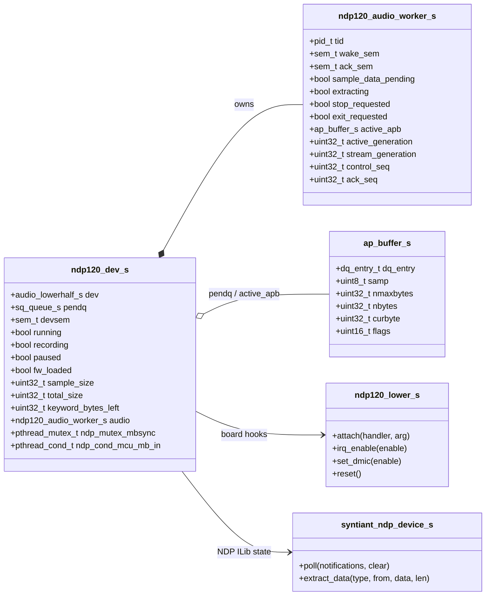
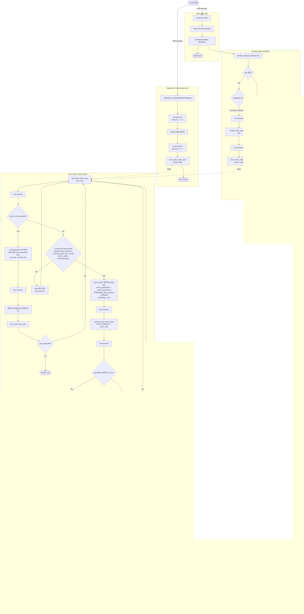
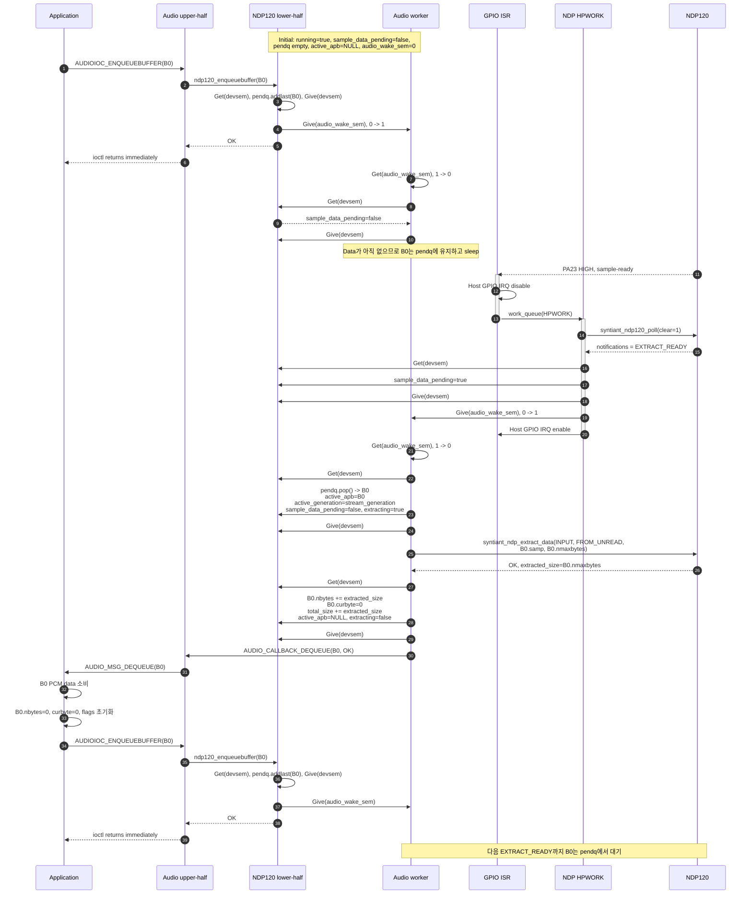

# NDP120 asynchronous audio capture design

## 1. 목적과 범위

현재 NDP120 녹음 경로는 `ndp120_enqueuebuffer()`를 호출한 application 문맥에서 sample-ready condition을 기다린 뒤 PCM data를 읽고 APB를 dequeue한다. 이 문서는 다음과 같이 buffer enqueue와 PCM extraction을 분리하는 설계를 정의한다.

- `ndp120_enqueuebuffer()`는 APB를 pending queue에 넣고 즉시 반환한다.
- 기존 GPIO IRQ와 HPWORK는 `syntiant_ndp120_poll()`을 이용한 interrupt 원인 확인과 clear를 담당한다.
- 새 audio worker thread는 NDP120의 unread PCM data를 APB에 채우고 `AUDIO_CALLBACK_DEQUEUE`를 호출한다.
- 기존 mailbox, keyword detection, error notification 처리는 HPWORK에 유지한다.

이 문서는 설계안이며 실제 C 구현은 포함하지 않는다.

## 2. 선택한 실행 구조

```text
NDP120 sample-ready
    -> GPIO level IRQ
        -> host GPIO IRQ disable
        -> existing HPWORK schedule
            -> syntiant_ndp120_poll(clear = 1)
            -> EXTRACT_READY이면 sample_data_pending = true
            -> sem_post(audio_wake_sem)
            -> mailbox/KD/error notification 처리
            -> host GPIO IRQ enable

Application
    -> ndp120_enqueuebuffer(apb)
        -> pendq에 APB 추가
        -> sem_post(audio_wake_sem)
        -> 즉시 return

Audio worker
    -> sem_wait(audio_wake_sem)
    -> data-ready와 pending APB가 모두 있으면 APB 선택
    -> syntiant_ndp_extract_data(FROM_UNREAD)
    -> APB를 채움
    -> AUDIO_CALLBACK_DEQUEUE
```

`syntiant_ndp120_poll()`은 새 audio worker가 아니라 기존 HPWORK만 호출한다. 한 interrupt를 HPWORK와 audio worker가 각각 poll하면 먼저 호출한 쪽이 notification을 clear할 수 있으므로 poll owner는 하나만 두어야 한다.

또한 다음 두 interrupt enable을 구분한다.

| 구분 | 제어 함수 | 의미 |
|---|---|---|
| NDP sample-ready source | `ndp120_set_sample_ready_int()` | NDP120이 sample-ready notification을 생성할지 결정한다. `start/resume`에서 enable하고 `pause/stop`에서 disable한다. |
| Host GPIO IRQ mask | `lower->irq_enable()` | PA23 level IRQ를 host가 받을지 결정한다. ISR 진입 시 disable하고 HPWORK가 interrupt status를 clear한 뒤 enable한다. |

## 3. 설계 원칙

1. `audio_wake_sem`은 PCM sample 개수를 나타내지 않는다. worker를 깨우는 event semaphore로만 사용한다.
2. 아직 처리하지 못한 data-ready 상태는 `sample_data_pending`이 보존한다.
3. 실제 unread byte 수는 `syntiant_ndp_extract_data()`가 돌려주는 `extracted_size`로 판단한다.
4. APB는 enqueue 성공 시점부터 `AUDIO_CALLBACK_DEQUEUE` 시점까지 lower-half가 소유한다.
5. `devsem`은 queue와 worker 상태를 보호하는 짧은 critical section에만 사용한다. SPI extraction과 upper callback 중에는 잡지 않는다.
6. NDP120 API의 device access 직렬화는 기존 `ndp_mutex_mbsync`가 담당한다.
7. stop 중 시작된 extraction과 새 stream을 구분하기 위해 `stream_generation`을 사용한다.
8. recording이 중지되어도 mailbox와 keyword IRQ 처리가 필요하므로 HPWORK와 audio worker는 device lifetime 동안 유지한다.

## 4. Event와 semaphore 정의

### 4.1 용어

| 표현 | 실제 동작 |
|---|---|
| Give / Notify | `sem_post()` |
| Get / Take | `sem_wait()` 또는 EINTR를 처리하는 wrapper |
| Binary semaphore | 초기값 1인 mutual exclusion semaphore |
| Event semaphore | 초기값 0인 counting semaphore. event 발생 시 post한다. |

### 4.2 Semaphore 목록

| Semaphore | 초기값 | Give 주체 | Get 주체 | 용도 |
|---|---:|---|---|---|
| `devsem` | 1 | queue/state 사용을 끝낸 모든 thread | enqueue caller, HPWORK, audio worker, start/stop caller | `pendq`, `running`, `paused`, worker state 보호 |
| `audio_wake_sem` | 0 | HPWORK, enqueue/start/resume/stop/shutdown caller | audio worker | audio worker를 깨우는 event notification |
| `audio_ack_sem` | 0 | audio worker | stop/shutdown caller | active extraction과 pending APB 정리가 끝났음을 알리는 control acknowledgement |
| `reset_sem` | 1 | 기존 NDP reset/aliveness 경로 | 기존 NDP reset/aliveness 경로 | 기존 기능 유지. audio queue 동기화 용도로 사용하지 않음 |

`audio_ack_sem`은 stale post를 오인하지 않도록 `control_seq`와 `ack_seq`를 함께 검사한다. stop/shutdown caller는 자신이 요청한 sequence가 acknowledge될 때까지 기다린다.

### 4.3 Worker wake 조건

`audio_wake_sem`은 wakeup 수단일 뿐 wake 원인 자체를 저장하지 않는다. worker는 깨어난 뒤 `devsem`으로 보호되는 실제 상태를 확인한다.

| 상태 | 설정 주체 | 설정 조건 | worker 동작 |
|---|---|---|---|
| `sample_data_pending` | HPWORK | poll 결과에 `EXTRACT_READY`가 포함됨 | pending APB가 있으면 unread PCM 추출 |
| `pendq` | `enqueuebuffer()` | APB enqueue | sample data가 pending이면 APB 선택 |
| `running`, `paused` | `start/resume/pause/stop` | stream 상태 변경 | extraction 가능 여부 판단 |
| `stop_requested` | `stop/release` | APB 회수 요청 | active/pending APB 반환 후 ack |

Event producer는 다음 순서를 지킨다.

```text
sem_wait(devsem)
    -> 실제 상태 변수 또는 queue 갱신
sem_post(devsem)
sem_post(audio_wake_sem)
```

상태를 먼저 기록한 다음 worker를 깨워야 worker가 이전 상태를 보는 race를 피할 수 있다.

## 5. 필요한 구조체와 관계

아래에서 `ndp120_audio_worker_s`는 새로 필요한 개념 구조체이고, 나머지는 기존 구조체를 확장하거나 그대로 사용한다.



### 5.1 새 worker state 사용법

| Field | 초기값 | 보호 | 사용법 |
|---|---:|---|---|
| `tid` | invalid | initialization/shutdown | device lifetime 동안 실행되는 audio worker 식별자 |
| `wake_sem` | 0 | semaphore 자체 | data, buffer, control event가 발생하면 worker를 깨움 |
| `ack_sem` | 0 | semaphore 자체 + sequence | stop/shutdown 완료 통보 |
| `sample_data_pending` | false | `devsem` | IRQ는 왔지만 APB가 없는 상태를 포함하여 unread data 가능성을 보존 |
| `extracting` | false | `devsem` | `active_apb`에 대한 SPI extraction 진행 여부 |
| `active_apb` | NULL | `devsem` | APB를 여러 sample-ready event에 걸쳐 채울 때 유지하는 현재 APB |
| `active_generation` | 0 | `devsem` | active APB를 선택했을 때의 stream generation |
| `stream_generation` | 0 | `devsem` | start/stop 경계를 구분. stop 시 증가 |
| `stop_requested` | false | `devsem` | worker가 active/pending APB를 반환해야 함을 표시 |
| `exit_requested` | false | `devsem` | worker main loop 종료 요청 |
| `control_seq`, `ack_seq` | 0 | `devsem` | stop/shutdown request와 acknowledgement 대응 |

`paused`가 기존 구조체에 없다면 추가한다. `running=true, paused=true`는 stream session은 유지하지만 extraction은 중단된 상태를 의미한다.

## 6. Event별 semaphore와 변수 변화

| 발생 event | 실행 문맥 | Semaphore 동작 | 변수/queue 변화 | 후속 동작 |
|---|---|---|---|---|
| APB enqueue | application ioctl | `Get(devsem)` -> `Give(devsem)` -> `Give(audio_wake_sem)` | `pendq` tail에 APB 추가 | 즉시 return. worker는 data-ready가 없으면 다시 sleep |
| Sample-ready GPIO IRQ | ISR | audio semaphore 동작 없음 | host GPIO IRQ disable | 기존 HPWORK schedule 후 ISR return |
| `EXTRACT_READY` 확인 | HPWORK | `Get(devsem)` -> `Give(devsem)` -> `Give(audio_wake_sem)` | `sample_data_pending=true` | 다른 notification 처리 후 host GPIO IRQ enable |
| Mailbox/KD/error IRQ | HPWORK | 기존 mailbox condition/MQ 사용 | 기존 notification state 변화 | audio semaphore는 `EXTRACT_READY`가 같이 있을 때만 give |
| Worker wake | audio worker | `Get(audio_wake_sem)` -> 필요 시 `Get/Give(devsem)` | 실제 상태 확인, APB pop, `extracting=true` | SPI extraction 실행 |
| Extraction 완료 | audio worker | `Get(devsem)` -> state update -> `Give(devsem)` | APB `nbytes` 증가, full이면 `active_apb=NULL`, `extracting=false` | lock 밖에서 dequeue callback |
| Extraction 결과 0 또는 `DATA_REREAD` | audio worker | 추가 semaphore 없음 | APB 유지, 선택 시 소비한 pending flag는 false로 유지하되 extraction 중 새 IRQ가 설정한 pending 상태는 보존 | 다음 sample-ready를 기다림 |
| Start/Resume | control caller | `Get/Give(devsem)` -> `Give(audio_wake_sem)` | `running=true`, `paused=false` | 이미 pending인 data 또는 keyword buffer가 있으면 즉시 처리 |
| Pause | control caller | `Get/Give(devsem)` | `paused=true`, NDP sample-ready source disable | APB queue와 active APB는 유지 |
| Stop/Release | control caller | `Get/Give(devsem)` -> `Give(audio_wake_sem)` -> `Get(audio_ack_sem)` | `running=false`, `stop_requested=true`, generation 증가 | worker가 active/pending APB를 반환하고 ack |
| Shutdown | control caller | `Get/Give(devsem)` -> `Give(audio_wake_sem)` -> `Get(audio_ack_sem)` | `exit_requested=true`, control sequence 증가 | worker 종료 후 ack, semaphore/thread resource 해제 |

## 7. Activity Diagram



Activity Diagram의 `STALE -> COMPLETE` 경로에서 APB를 어떤 status와 `nbytes`로 반환할지는 stop 정책으로 결정한다. 강제 stop이면 `nbytes=0`과 cancel/error status를, graceful drain이면 이미 채운 partial data를 반환할 수 있다.

## 8. APB fill 정책

권장 buffer 크기는 현재 `4 * sample_size`이므로 worker는 APB를 full period까지 누적한 뒤 dequeue하는 정책을 기본으로 한다.

1. `active_apb == NULL`이면 `pendq`에서 하나를 pop한다.
2. extraction destination은 `active_apb->samp + active_apb->nbytes`다.
3. 요청 길이는 `nmaxbytes - nbytes`이며 NDP sample frame의 배수가 되어야 한다.
4. APB를 선택할 때 현재 `sample_data_pending`을 소비한다. extraction 중 HPWORK가 새 pending 상태를 설정할 수 있으므로 extraction 완료 시 이를 무조건 false로 덮어쓰면 안 된다.
5. 일부만 읽었으면 `active_apb`를 유지하고 다음 sample-ready를 기다린다.
6. APB가 가득 차면 `curbyte=0`으로 설정하고 dequeue한다.
7. 요청 길이만큼 모두 읽었다면 NDP ring에 data가 더 있을 가능성이 있으므로 bounded self-wake로 다음 pending APB를 시도할 수 있다.
8. extraction이 0 byte 또는 `DATA_REREAD`를 반환하면 active APB는 유지하고 다음 IRQ를 기다린다. 단, extraction 중 도착한 새 pending 상태는 보존한다.

낮은 latency가 더 중요하다면 partial APB를 즉시 dequeue하는 정책도 가능하지만, buffer 크기와 callback 주기가 달라지므로 별도의 정책으로 명시해야 한다.

## 9. Sequence Diagram: 정상 녹음 중 APB 한 개 완료

### 9.1 시나리오 전제

- 녹음은 이미 시작되어 있다: `running=true`, `paused=false`.
- `sample_data_pending=false`, `active_apb=NULL`, `audio_wake_sem=0`이다.
- application이 이전에 사용한 APB `B0`를 다시 enqueue한다.
- 이후 sample-ready IRQ 한 번에서 `B0.nmaxbytes`만큼 unread PCM을 읽을 수 있다고 가정한다.
- dequeue message를 받은 application은 PCM을 사용한 후 `B0`를 다시 enqueue한다.



## 10. Race와 예외 처리

| 상황 | 필요한 동작 |
|---|---|
| IRQ가 APB보다 먼저 발생 | `sample_data_pending=true`를 유지한다. worker가 빈 queue를 확인해도 pending 상태를 지우지 않는다. 이후 enqueue가 worker를 깨운다. |
| APB가 IRQ보다 먼저 enqueue | APB는 `pendq`에 유지한다. enqueue wake를 소비한 worker는 data-ready가 없으면 다시 sleep한다. |
| 여러 sample-ready가 하나의 IRQ로 합쳐짐 | semaphore 횟수에 의존하지 않고 NDP ring에서 반환된 실제 byte 수를 사용한다. |
| 한 IRQ에 여러 APB 분량이 존재 | 한 번에 한 APB씩 bounded drain한다. 매 APB 후 control event와 새 IRQ를 확인해 mailbox/KD 처리를 장시간 지연시키지 않는다. |
| APB가 없는 동안 ring이 overflow | 명시적인 overrun counter를 증가시키고 필요하면 `AUDIO_CALLBACK_IOERR`를 통해 XRUN을 보고한다. |
| stop이 SPI extraction 중 발생 | stop caller가 `running=false`, generation 증가 후 worker를 깨운다. worker는 extraction 복귀 후 generation mismatch를 확인하여 APB를 반환하고 ack한다. |
| HPWORK poll 실패 | audio worker에는 data-ready를 알리지 않는다. host IRQ를 영구 disable하지 않도록 re-enable 또는 device recovery 경로로 진입한다. |
| `sem_post(audio_wake_sem)`이 여러 번 발생 | 정상이다. worker는 semaphore count가 아니라 `sample_data_pending`, queue, control state를 기준으로 처리한다. |
| dequeue callback 중 application이 즉시 re-enqueue | callback은 `devsem` 밖에서 호출하므로 queue lock deadlock이 발생하지 않는다. |

## 11. 기존 함수별 변경 책임

| 함수/영역 | 설계상 책임 |
|---|---|
| `ndp120_enqueuebuffer()` | 모든 APB를 `pendq`에 추가하고 `audio_wake_sem`으로 worker를 깨운 뒤 즉시 반환 |
| `ndp120_irq_handler_work()` | 기존 poll/KD/mailbox/error 처리 유지. `EXTRACT_READY`에서 pending 상태 설정과 `audio_wake_sem` post |
| `ndp120_extract_audio()` | condition wait를 제거한 non-blocking extraction helper와, 필요하다면 legacy/debug wait 경로로 분리 |
| `ndp120_start()` | queued APB를 동기 처리하거나 free하지 않고 state 변경, sample-ready source enable, worker wake만 수행 |
| `ndp120_pause()/resume()` | APB 소유권은 유지하면서 sample-ready source와 `paused` 상태 제어 |
| `ndp120_stop()/release()` | generation 변경, worker stop request, pending/active APB 회수, acknowledgement 대기 |
| `ndp120_cancelbuffer()` | `pendq` 또는 `active_apb`에서 대상 APB를 안전하게 취소하고 upper-half에 반환 |
| initialize/shutdown | worker semaphore 초기화, thread 생성, exit handshake, semaphore destroy |

`CONFIG_DUMP4CH_SUPPORT`의 blocking debug stream이 기존 `ndp_cond_notification_sample`을 사용한다면, 일반 recording 경로를 `audio_wake_sem`으로 전환한 뒤에도 debug 전용 condition signal은 별도로 유지해야 한다.
